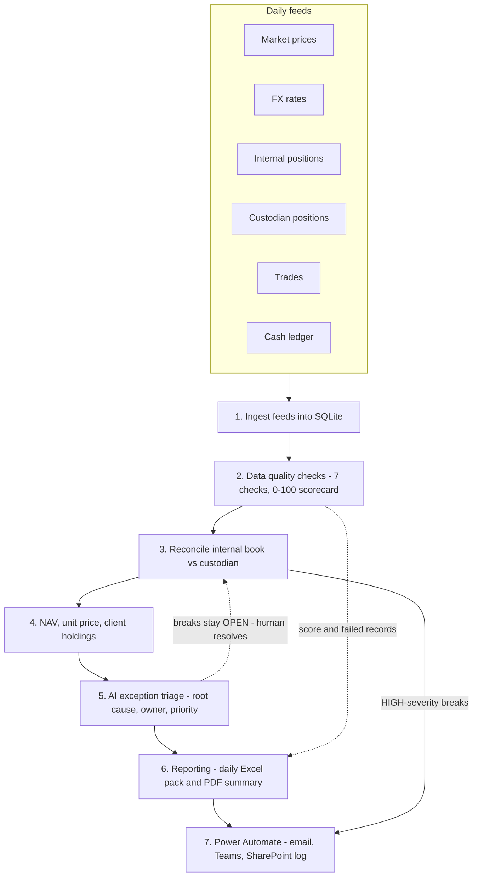

# PoolDesk — daily operations process flow

The daily Investment Operations workflow PoolDesk automates, end to end.

## Step notes

| Step | Module | What happens |
|---|---|---|
| 1 Ingest | `ingest.py` | Six feed files per business day land in SQLite, atomically. |
| 2 Data quality | `data_quality.py` | Schema, completeness, staleness, outlier, duplicate, referential integrity and FX checks; a 0-100 scorecard. |
| 3 Reconcile | `reconcile.py` | Internal vs custodian positions; breaks classified and sized by CAD market-value impact. |
| 4 NAV | `nav.py` | Pool NAV, unit price, per-client holding value, daily P&L — on scrubbed prices. |
| 5 AI triage | `ai_assistant.py` | Each open break gets a probable root cause, owner team, priority and resolution note. |
| 6 Reporting | `reporting.py` | Six-tab Excel ops pack, one-page PDF, weekly/monthly roll-ups. |
| 7 Distribute | `automate/flow_spec.md` | The flow emails the pack, posts to Teams, escalates HIGH breaks, logs the run. |

The orchestrator (`main.py`) runs steps 1-6 in order and logs each step's
duration to `reports/pipeline.log`. Breaks are **triaged** by the AI, never
auto-resolved — resolution stays a human decision (human-in-the-loop).
